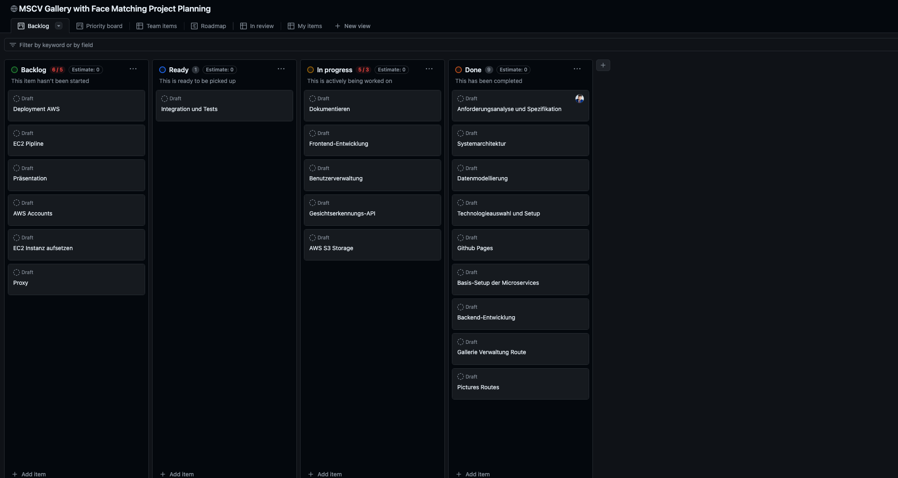

# Sprint 2 Abschluss

## Fazit vom Sprint 2

Der zweite Sprint des Projekts war intensiv und brachte sowohl Erfolge als auch Herausforderungen mit sich. Die Implementierung der Kernfunktionen und grundlegender Sicherheitsmechanismen stand im Fokus. Während wesentliche Fortschritte erzielt wurden, gibt es auch Bereiche, die weiter verbessert werden müssen. Insbesondere wurde die Komplexität der Frontend-Entwicklung unterschätzt, was zu Verzögerungen führte.

### Erreichte Ziele

1. **Galerieverwaltung implementieren**
   - Erstellen, verwalten und löschen von Galerien
   - Hinzufügen und entfernen von Bildern

2. **Bildverwaltung implementieren**
   - Hochladen, speichern und abrufen von Bildern
   - Anbindung an AWS S3

3. **API-Struktur planen und implementieren**
   - API-Endpoints für Backend-Services definiert
   - Integration der Gesichtserkennungs-API geplant

4. **Sicherheitsmechanismen integrieren**
   - Authentifizierung und Autorisierung mit JWT
   - Implementierung von Sicherheitsrichtlinien für Datenverschlüsselung und Schutz

5. **Frontend-Entwicklung gestartet**
   - Erste Schritte zur Implementierung der Frontend-Funktionalitäten in Vue

### Noch nicht fertiggestellte Aufgaben

1. **Benutzerverwaltung implementieren**
   - Registrierung, Login und Benutzerprofilverwaltung
   - Integration der Benutzerverwaltung ins Frontend, die in Vue geschrieben ist, funktioniert noch nicht reibungslos

### Status Prozentual

| Bereich           | Fortschritt |
| ----------------- | ----------- |
| Dokumentation     | 20 %        |
| Konzept           | 90 %        |
| Backend           | 60 %        |
| Frontend          | 10 %        |
| AWS EC2           | 0 %         |
| GitHub Deployment | 0 %         |

### Kanban Board

### Learnings für den nächsten Sprint

#### Bessere Integration von Backend und Frontend

Die Integration der Benutzerverwaltung im Backend mit dem Frontend in Vue stellte sich als komplex heraus. Im nächsten Sprint werde ich mehr Zeit und Ressourcen für die nahtlose Integration dieser beiden Komponenten einplanen.

#### Verstärktes Testen und Debuggen

Die Herausforderungen bei der Integration zeigen die Notwendigkeit eines intensiveren Test- und Debugging-Prozesses. Durch gezielte Tests und frühzeitiges Erkennen von Problemen kann die Integration reibungsloser verlaufen.

#### Realistische Zeitplanung

Trotz zusätzlicher Arbeitszeit wurden nicht alle geplanten Aufgaben vollständig abgeschlossen. Eine realistischere Zeitplanung und Priorisierung der Aufgaben sind notwendig, um die gesetzten Ziele zu erreichen.

#### Unterschätzung der Frontend-Entwicklung

Die Komplexität und der Umfang der Frontend-Entwicklung wurden unterschätzt. Im nächsten Sprint wird ein grösserer Fokus auf die Entwicklung und Integration des Frontends gelegt, um sicherzustellen, dass es reibungslos mit dem Backend zusammenarbeitet.

## Kritische Würdigung des Sprint-Reviews

Während des Sprint-Reviews wurde deutlich, dass trotz intensiver Arbeit und zusätzlichem Aufwand einige der geplanten Ziele nicht vollständig erreicht wurden. Das Backend läuft nun mit den Basis-Setups, und die Galerien- und Bilder-Routes sind implementiert. Jedoch funktioniert das Zusammenspiel mit dem Frontend noch nicht zufriedenstellend.

Die Rückmeldungen aus dem Review unterstreichen die Notwendigkeit einer flexibleren Planung und eines besseren Zeitmanagements. Besonders die Integration des Backends mit dem Frontend in Vue erfordert mehr Aufmerksamkeit und detaillierte Planung.

Insgesamt hat der Sprint wertvolle Erkenntnisse geliefert, die in den folgenden Sprints berücksichtigt werden können, um die Effizienz zu steigern und die gesetzten Ziele zu erreichen. Die nächsten Schritte werden darauf abzielen, die Integration zu verbessern und die verbleibenden Funktionen vollständig zu implementieren.